# Mydea 系统改进设计文档

## 1. 概述

### 1.1 当前系统现状

Mydea 是一个基于 Google Gemini AI 的智能广告创意生成平台，当前采用纯前端架构，主要技术栈包括 React、TypeScript 和 Vite。系统通过本地存储（localStorage）管理数据，直接在客户端调用 Gemini API。

### 1.2 改进目标

本次改进旨在解决以下核心问题：

- **安全性**：消除 API Key 在客户端暴露的风险
- **可靠性**：提升数据持久化能力和系统稳定性
- **用户体验**：优化错误处理、加载状态和响应性能
- **可维护性**：建立测试体系和代码质量保障机制

### 1.3 改进范围

按照优先级分为三个阶段实施，重点关注高优先级和中优先级改进项。

## 2. 架构演进设计

### 2.1 目标架构概览

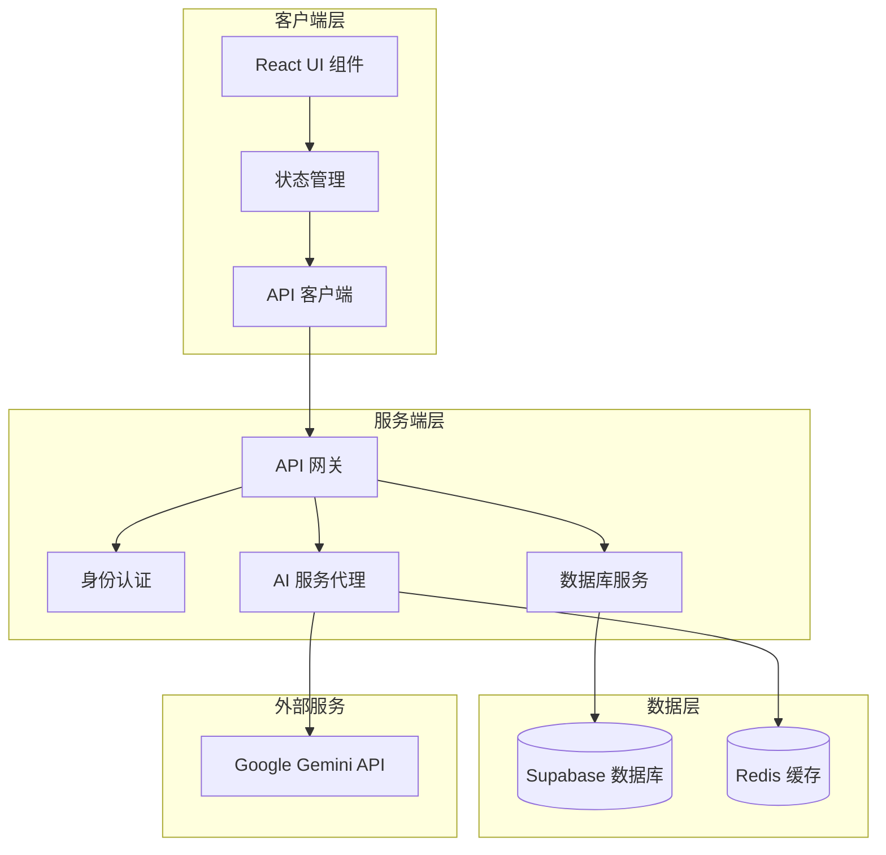

### 2.2 架构层次说明

| 层次 | 职责 | 主要变化 |
|------|------|----------|
| 客户端层 | UI 渲染、用户交互、本地状态管理 | 移除直接 API 调用，统一使用 API 客户端 |
| 服务端层 | API 代理、业务逻辑、安全控制 | **新增层**，保护敏感凭证，实现请求控制 |
| 数据层 | 数据持久化、缓存管理 | 从 localStorage 迁移到 Supabase |
| 外部服务 | 第三方 AI 服务 | 由服务端代理调用 |

### 2.3 架构决策记录

#### ADR-001: 采用后端代理模式

**决策**：引入后端服务层代理所有 Gemini API 调用

**理由**：
- 保护 API Key 不暴露在客户端
- 实现请求速率限制和成本控制
- 支持请求日志和监控
- 为未来多 AI 模型切换提供灵活性

**替代方案**：直接在前端调用（现状），风险高

#### ADR-002: 选择 Supabase 作为数据库方案

**决策**：使用 Supabase 替代 localStorage

**理由**：
- 提供 PostgreSQL 数据库和实时功能
- 内置认证和行级安全策略
- 免费额度足够初期使用
- 开发效率高，无需自建后端

**替代方案**：
- Firebase（成本较高，Google 生态绑定）
- 自建 MongoDB（运维成本高）

#### ADR-003: 采用渐进式迁移策略

**决策**：分阶段实施改进，优先处理安全和稳定性

**理由**：
- 降低一次性重构风险
- 每个阶段产出可验证价值
- 保持系统持续可用

## 3. 第一阶段：安全性与稳定性改进

### 3.1 API 安全架构设计

#### 3.1.1 服务端代理层设计

**职责定义**：

| 组件 | 职责 | 输入 | 输出 |
|------|------|------|------|
| API 网关 | 请求路由、认证验证、速率限制 | HTTP 请求 | 转发到对应服务 |
| AI 服务代理 | Gemini API 调用、结果转换、错误处理 | 业务请求参数 | 标准化响应 |
| 缓存层 | 缓存常见请求、降低 API 调用成本 | 请求标识 | 缓存结果或空 |

#### 3.1.2 API 端点设计

| 端点 | 方法 | 功能 | 对应原服务 |
|------|------|------|------------|
| `/api/brief/refine` | POST | 需求分析 | `refineBrief()` |
| `/api/creative/generate` | POST | 生成创意包 | `generateCreativePackage()` |
| `/api/proposal/optimize` | POST | 优化方案 | `optimizeProposal()` |
| `/api/execution/plan` | POST | 生成执行计划 | `generateExecutionPlan()` |

**请求/响应规范**：

请求结构（示例：需求分析）：
```
POST /api/brief/refine
Content-Type: application/json
Authorization: Bearer <user_token>

请求体：
{
  briefText: string;
  creativeType: string;
}
```

响应结构：
```
成功响应（200）：
{
  success: true;
  data: {
    summary: string;
    questions: string[];
  }
}

错误响应（4xx/5xx）：
{
  success: false;
  error: {
    code: string;
    message: string;
    retryable: boolean;
  }
}
```

#### 3.1.3 安全控制策略

**认证流程**：

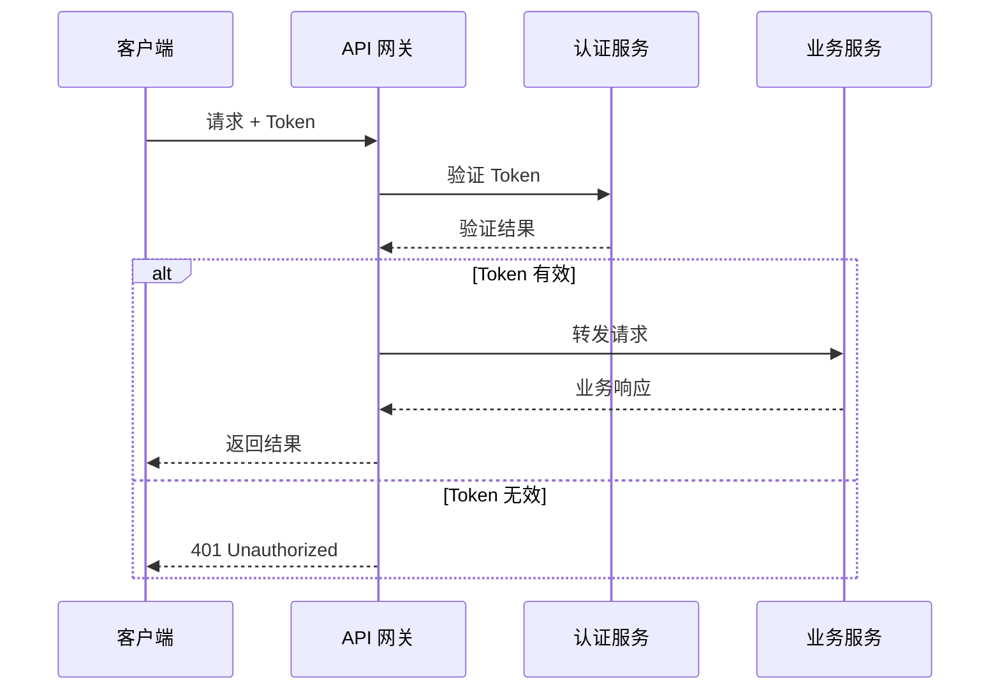

**速率限制策略**：

| 用户类型 | 每分钟请求数 | 每日请求数 | 超限处理 |
|----------|--------------|------------|----------|
| 免费用户 | 10 | 100 | 返回 429 错误 |
| 付费用户 | 60 | 1000 | 返回 429 错误 |

### 3.2 统一错误处理设计

#### 3.2.1 错误分类体系

| 错误类别 | 错误代码前缀 | 示例 | 用户消息策略 |
|----------|--------------|------|--------------|
| 客户端错误 | CLI_ | CLI_INVALID_INPUT | 显示具体字段错误 |
| 认证错误 | AUTH_ | AUTH_TOKEN_EXPIRED | 引导重新登录 |
| 业务错误 | BIZ_ | BIZ_QUOTA_EXCEEDED | 显示业务规则说明 |
| 外部服务错误 | EXT_ | EXT_GEMINI_TIMEOUT | 提示稍后重试 |
| 系统错误 | SYS_ | SYS_DATABASE_ERROR | 显示通用错误消息 |

#### 3.2.2 错误处理流程

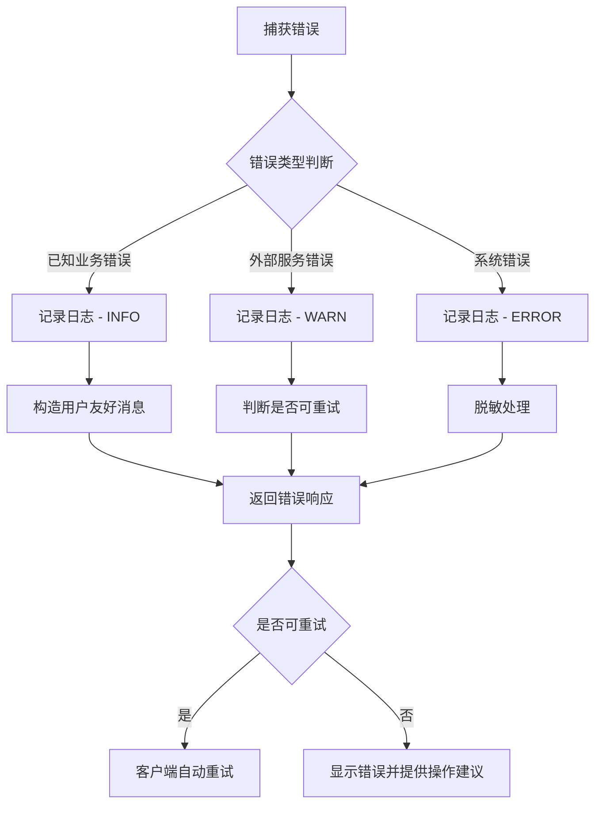

#### 3.2.3 错误恢复策略

| 场景 | 恢复策略 | 用户提示 |
|------|----------|----------|
| 网络超时 | 自动重试 3 次，间隔递增 | "正在重试连接..." |
| API 限流 | 等待后自动重试 | "请求繁忙，请稍候..." |
| 数据库错误 | 不重试，记录日志 | "系统暂时不可用，请稍后再试" |
| AI 生成失败 | 允许用户重新生成 | "生成失败，请重试或修改需求" |

### 3.3 请求优化设计

#### 3.3.1 超时控制策略

| API 类型 | 超时时间 | 理由 |
|----------|----------|------|
| 需求分析 | 15 秒 | 快速模型，返回内容少 |
| 灵感搜索 | 20 秒 | 包含网络搜索，时间较长 |
| 创意生成 | 45 秒 | 使用 Pro 模型，内容复杂 |
| 方案优化 | 30 秒 | 单个方案优化 |
| 执行计划 | 30 秒 | 文本生成任务 |

#### 3.3.2 重试机制设计

**重试决策矩阵**：

| HTTP 状态码 | 是否重试 | 最大重试次数 | 退避策略 |
|-------------|----------|--------------|----------|
| 408 (Timeout) | 是 | 3 | 指数退避（1s, 2s, 4s） |
| 429 (Rate Limit) | 是 | 2 | 固定 5s |
| 500 (Server Error) | 是 | 2 | 线性退避（2s, 4s） |
| 502/503/504 | 是 | 3 | 指数退避 |
| 400/401/403/404 | 否 | 0 | - |

**重试流程**：

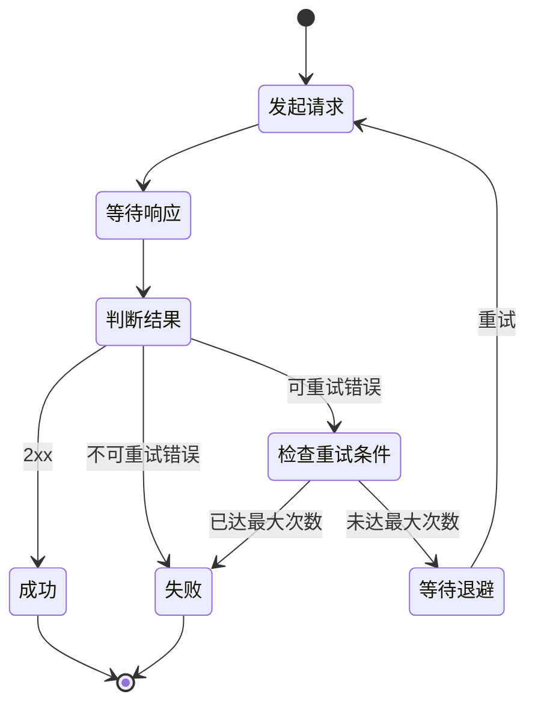

#### 3.3.3 缓存策略设计

**缓存层级**：

| 层级 | 位置 | 缓存内容 | 过期时间 | 目的 |
|------|------|----------|----------|------|
| L1 内存缓存 | 服务端进程内 | 热点灵感案例 | 10 分钟 | 减少 API 调用 |
| L2 分布式缓存 | Redis | 需求分析结果 | 1 小时 | 支持横向扩展 |
| L3 客户端缓存 | sessionStorage | 当前会话数据 | 会话结束 | 减少网络请求 |

**缓存键设计**：

```
格式：{service}:{operation}:{hash}

示例：
- brief:refine:hash("咖啡品牌Slogan需求...")
- inspiration:search:hash("咖啡营销案例")
```

## 4. 第二阶段：数据持久化改进

### 4.1 数据库架构设计

#### 4.1.1 数据模型设计

**表结构定义**：

**用户表（users）**

| 字段名 | 类型 | 约束 | 说明 |
|--------|------|------|------|
| id | uuid | PRIMARY KEY | 用户唯一标识 |
| username | text | UNIQUE, NOT NULL | 用户名 |
| email | text | UNIQUE | 邮箱（可选） |
| created_at | timestamptz | DEFAULT now() | 创建时间 |
| updated_at | timestamptz | DEFAULT now() | 更新时间 |

**项目表（projects）**

| 字段名 | 类型 | 约束 | 说明 |
|--------|------|------|------|
| id | uuid | PRIMARY KEY | 项目唯一标识 |
| user_id | uuid | FOREIGN KEY → users(id) | 所属用户 |
| name | text | NOT NULL | 项目名称 |
| description | text | - | 项目描述 |
| created_at | timestamptz | DEFAULT now() | 创建时间 |
| updated_at | timestamptz | DEFAULT now() | 更新时间 |

**创意任务表（briefs）**

| 字段名 | 类型 | 约束 | 说明 |
|--------|------|------|------|
| id | uuid | PRIMARY KEY | 任务唯一标识 |
| project_id | uuid | FOREIGN KEY → projects(id) | 所属项目 |
| initial_brief | jsonb | NOT NULL | 初始需求 |
| refined_brief_text | text | - | 精炼后需求 |
| inspirations | jsonb | - | 灵感案例数组 |
| proposals | jsonb | - | 创意方案数组 |
| created_at | timestamptz | DEFAULT now() | 创建时间 |
| updated_at | timestamptz | DEFAULT now() | 更新时间 |

#### 4.1.2 数据关系图

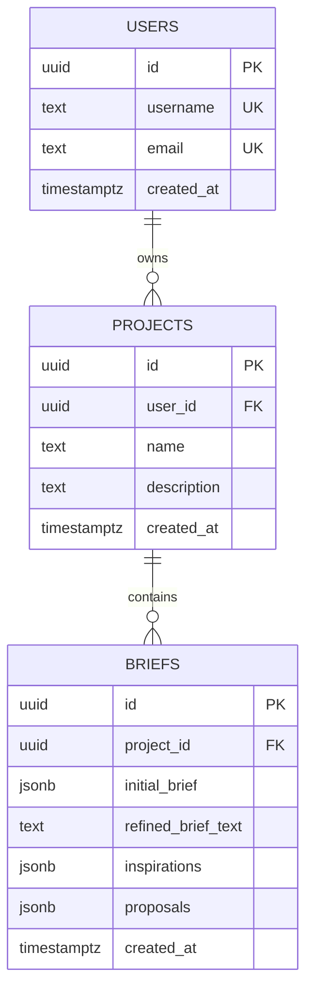

#### 4.1.3 行级安全策略（RLS）

**策略定义**：

| 表名 | 操作 | 策略规则 | 说明 |
|------|------|----------|------|
| users | SELECT | `auth.uid() = id` | 仅可查看自己的信息 |
| users | UPDATE | `auth.uid() = id` | 仅可更新自己的信息 |
| projects | SELECT | `user_id = auth.uid()` | 仅可查看自己的项目 |
| projects | INSERT | `user_id = auth.uid()` | 仅可创建自己的项目 |
| projects | UPDATE | `user_id = auth.uid()` | 仅可更新自己的项目 |
| projects | DELETE | `user_id = auth.uid()` | 仅可删除自己的项目 |
| briefs | SELECT | `project_id IN (用户的项目)` | 通过项目关联验证 |
| briefs | INSERT/UPDATE/DELETE | 同上 | 通过项目关联验证 |

### 4.2 数据迁移设计

#### 4.2.1 迁移策略

**迁移流程**：

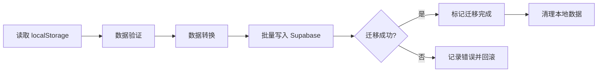

**迁移规则**：

| localStorage 字段 | Supabase 映射 | 转换逻辑 |
|-------------------|---------------|----------|
| `mydea_db[username]` | users.username | 直接映射 |
| `user.projects[]` | projects 表 | 为每个项目创建记录 |
| `project.briefs[]` | briefs 表 | JSONB 格式存储 |
| `mydea_session` | Supabase Auth | 使用新的认证系统 |

#### 4.2.2 数据兼容性处理

**版本控制**：

每条记录包含 `schema_version` 字段，支持未来数据结构演进。

| 版本 | 变更说明 | 迁移策略 |
|------|----------|----------|
| v1 | 初始 localStorage 格式 | 基准版本 |
| v2 | 迁移到 Supabase | 添加关系型字段 |
| v3（未来） | 扩展字段 | 在线迁移脚本 |

### 4.3 API 层数据操作设计

#### 4.3.1 数据服务接口定义

| 服务方法 | 参数 | 返回值 | 说明 |
|----------|------|--------|------|
| `getUserProfile(userId)` | userId: string | User 对象 | 获取用户完整信息 |
| `createProject(userId, name)` | userId, name | Project 对象 | 创建新项目 |
| `getProjectBriefs(projectId)` | projectId | Brief[] | 获取项目所有任务 |
| `saveBrief(projectId, data)` | projectId, briefData | Brief 对象 | 保存创意任务 |
| `deleteBrief(briefId)` | briefId | void | 删除任务 |

#### 4.3.2 查询优化策略

**索引设计**：

| 表 | 索引字段 | 类型 | 目的 |
|-----|----------|------|------|
| projects | user_id | B-tree | 加速用户项目查询 |
| briefs | project_id | B-tree | 加速项目任务查询 |
| briefs | created_at | B-tree | 支持时间排序 |
| briefs | proposals (JSONB) | GIN | 支持方案内容搜索 |

**查询模式**：

使用关联查询减少往返次数：
```
查询用户的所有项目及其最新任务：
- 单次查询返回嵌套结构
- 使用 Supabase 的关系查询语法
- 客户端无需多次请求
```

## 5. 第三阶段：用户体验优化

### 5.1 加载状态优化设计

#### 5.1.1 加载状态类型定义

| 状态类型 | 使用场景 | 视觉表现 | 用户感知 |
|----------|----------|----------|----------|
| 骨架屏 | 页面初始加载 | 内容区域灰色占位 | 即将看到内容 |
| 进度指示器 | 生成创意过程 | 分步骤进度条 | 了解当前进度 |
| 微调动画 | 小组件加载 | 旋转图标 | 系统正在响应 |
| 流式显示 | AI 文本生成 | 逐字显示 | 实时反馈 |

#### 5.1.2 加载策略设计

**分步骤反馈机制**：

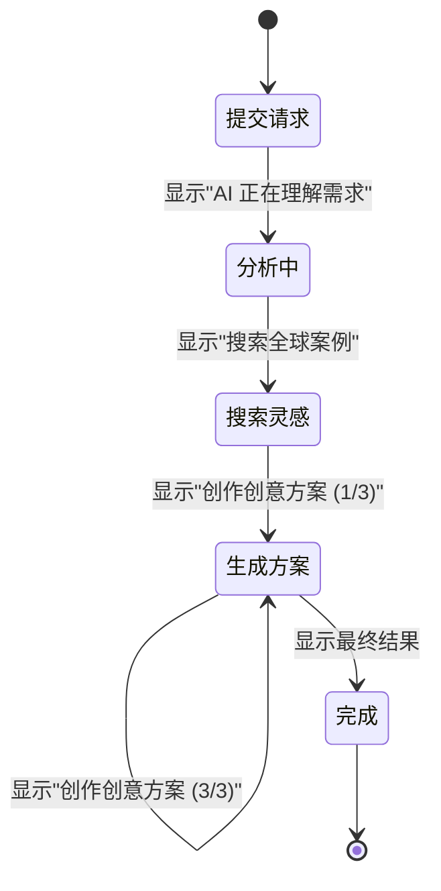

**预加载策略**：

| 场景 | 预加载内容 | 触发时机 |
|------|------------|----------|
| 项目列表页 | 最近打开的项目详情 | 列表渲染后 |
| 创意方案页 | 下一个方案的图片 | 当前方案展示时 |
| 优化历史 | 历史版本数据 | 展开历史面板前 |

### 5.2 移动端适配设计

#### 5.2.1 响应式断点定义

| 断点名称 | 视口宽度 | 目标设备 | 布局策略 |
|----------|----------|----------|----------|
| mobile | < 768px | 手机 | 单列布局，折叠导航 |
| tablet | 768px - 1024px | 平板 | 两列布局，侧边栏 |
| desktop | > 1024px | 桌面 | 三列布局，完整功能 |

#### 5.2.2 交互优化策略

**触摸优化**：

| 元素类型 | 最小尺寸 | 间距 | 理由 |
|----------|----------|------|------|
| 主要按钮 | 48×48 px | 8px | 符合人体工程学 |
| 列表项 | 高度 60px | 4px | 易于点击 |
| 文本输入框 | 高度 52px | - | 避免缩放 |

**手势支持**：

| 手势 | 功能 | 使用场景 |
|------|------|----------|
| 左滑 | 显示操作菜单 | 项目列表、任务列表 |
| 右滑 | 返回上一级 | 详情页 |
| 下拉 | 刷新列表 | 项目列表、任务列表 |
| 双击 | 快速定稿 | 创意方案卡片 |

### 5.3 性能优化设计

#### 5.3.1 代码分割策略

| 分割单元 | 加载时机 | 优先级 | 预期收益 |
|----------|----------|--------|----------|
| 登录/主页 | 初始加载 | 高 | 基线 |
| 项目管理模块 | 用户登录后 | 高 | 减少初始包 30% |
| 创意生成模块 | 点击"生成创意" | 中 | 减少初始包 40% |
| 项目详情模块 | 点击项目 | 中 | 减少初始包 15% |
| 导出功能模块 | 点击导出按钮 | 低 | 减少初始包 5% |

#### 5.3.2 渲染优化策略

**虚拟化渲染**：

| 组件 | 触发条件 | 策略 | 预期提升 |
|------|----------|------|----------|
| 项目列表 | > 20 个项目 | 虚拟滚动 | 减少 DOM 节点 80% |
| 任务历史列表 | > 50 条记录 | 虚拟滚动 | 初始渲染提速 3x |

**组件优化**：

| 优化类型 | 应用组件 | 判断依据 | 优化效果 |
|----------|----------|----------|----------|
| React.memo | 创意方案卡片 | props 深比较 | 避免不必要的重渲染 |
| useMemo | 灵感案例筛选 | 依赖 brief 类型 | 缓存计算结果 |
| useCallback | 事件处理函数 | 传递给子组件 | 避免子组件重渲染 |

#### 5.3.3 资源优化策略

**图片优化**：

| 图片类型 | 优化方案 | 说明 |
|----------|----------|------|
| 灵感案例图 | 懒加载 + WebP 格式 | 仅加载可视区域 |
| 占位图 | Base64 内联 | 小于 2KB 直接嵌入 |
| 用户头像 | CDN + 尺寸适配 | 移动端加载小尺寸 |

**字体优化**：

- 使用系统字体栈，避免自定义字体加载
- 必要时仅加载使用的字符子集

## 6. 测试策略设计

### 6.1 测试层次定义

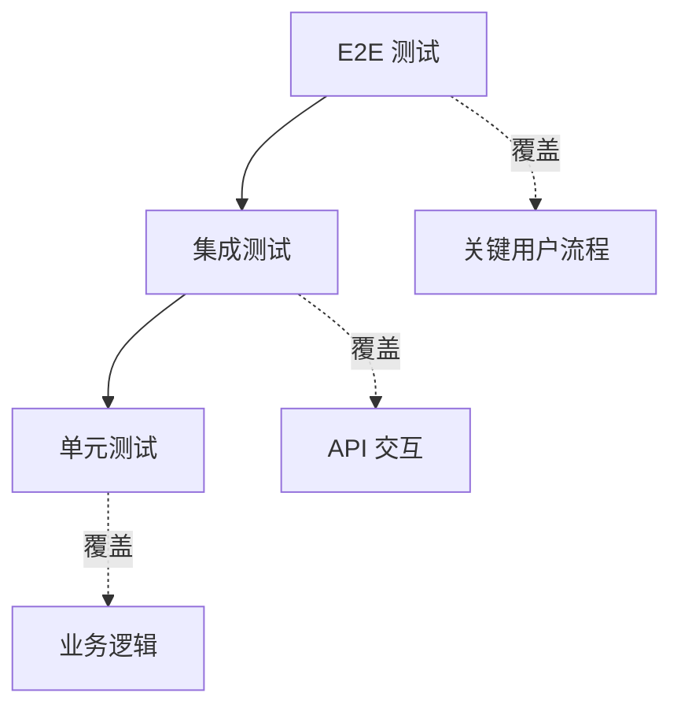

### 6.2 单元测试设计

#### 6.2.1 测试覆盖目标

| 模块 | 目标覆盖率 | 优先级 | 关键测试点 |
|------|------------|--------|------------|
| 数据服务 | 90% | 高 | CRUD 操作、边界条件 |
| 错误处理 | 85% | 高 | 各类错误分支 |
| 业务逻辑 | 80% | 中 | 状态转换、数据转换 |
| UI 组件 | 70% | 中 | 用户交互、条件渲染 |
| 工具函数 | 95% | 中 | 边界值、异常输入 |

#### 6.2.2 测试用例设计原则

**数据服务测试场景**：

| 场景类别 | 测试用例 | 验证点 |
|----------|----------|--------|
| 正常流程 | 创建用户成功 | 返回用户对象，数据库包含记录 |
| 边界条件 | 用户名为空 | 抛出验证错误 |
| 异常情况 | 用户已存在 | 抛出特定错误 |
| 数据一致性 | 删除项目后查询 | briefs 同步删除 |

**错误处理测试场景**：

| 错误类型 | 模拟方式 | 验证点 |
|----------|----------|--------|
| 网络超时 | Mock fetch 延迟 | 正确重试，最终返回超时错误 |
| API 限流 | Mock 429 响应 | 等待后重试，显示正确提示 |
| 数据验证失败 | 传入非法数据 | 返回具体字段错误 |

### 6.3 集成测试设计

#### 6.3.1 API 集成测试场景

| 测试场景 | 步骤 | 预期结果 |
|----------|------|----------|
| 完整创意生成流程 | 1. 提交需求<br>2. 获取分析结果<br>3. 生成创意包 | 每步返回正确数据，状态正确转换 |
| 方案优化流程 | 1. 提交优化反馈<br>2. 获取新版本 | 版本号递增，历史记录保存 |
| 认证失败处理 | 使用无效 token 请求 | 返回 401，客户端跳转登录 |

### 6.4 端到端测试设计

#### 6.4.1 关键用户旅程

**测试旅程 1：新用户首次使用**


**测试旅程 2：老用户继续工作**


## 7. 监控与可观测性设计

### 7.1 监控指标定义

#### 7.1.1 业务指标

| 指标名称 | 计算方式 | 阈值 | 告警条件 |
|----------|----------|------|----------|
| 创意生成成功率 | 成功次数 / 总次数 | > 95% | 低于 90% |
| 平均生成时长 | 总时长 / 成功次数 | < 60s | 超过 90s |
| 用户会话时长 | 登出时间 - 登录时间 | - | 低于 5min（留存问题） |
| 方案优化次数分布 | 统计每个方案的优化次数 | - | 平均超过 5 次（体验问题） |

#### 7.1.2 技术指标

| 指标名称 | 收集位置 | 阈值 | 告警条件 |
|----------|----------|------|----------|
| API 响应时间 P95 | 服务端 | < 3s | 超过 5s |
| 错误率 | 服务端 | < 1% | 超过 5% |
| 数据库查询时间 P99 | 数据库层 | < 500ms | 超过 1s |
| 前端页面加载时间 | 客户端 | < 2s | 超过 4s |

### 7.2 日志策略设计

#### 7.2.1 日志级别定义

| 级别 | 使用场景 | 示例 | 保留时间 |
|------|----------|------|----------|
| DEBUG | 开发调试信息 | 函数参数、中间变量 | 7 天 |
| INFO | 正常业务流程 | 用户登录、创意生成 | 30 天 |
| WARN | 可恢复的异常 | API 重试、降级服务 | 60 天 |
| ERROR | 需要关注的错误 | 未捕获异常、业务失败 | 90 天 |

#### 7.2.2 结构化日志格式

```
标准字段：
{
  timestamp: ISO 8601 时间戳
  level: 日志级别
  service: 服务名称
  trace_id: 请求追踪 ID
  user_id: 用户标识（脱敏）
  message: 日志消息
  context: 上下文数据（JSON）
  error: 错误堆栈（如有）
}
```

### 7.3 追踪设计

#### 7.3.1 分布式追踪

**追踪链路示例**：

```
用户提交需求 → API 网关 → AI 服务代理 → Gemini API
                    ↓
              数据库服务 → Supabase
```

每个环节记录：
- 操作名称
- 开始/结束时间
- 父级 span ID
- 标签（用户 ID、创意类型等）

## 8. 部署架构设计

### 8.1 部署模式选择

#### 8.1.1 推荐部署方案

| 组件 | 部署平台 | 理由 |
|------|----------|------|
| 前端静态资源 | Vercel / Netlify | 全球 CDN，自动 HTTPS |
| API 服务 | Vercel Serverless Functions | 无需管理服务器，按需扩展 |
| 数据库 | Supabase Cloud | 托管 PostgreSQL，免费额度 |
| 缓存 | Upstash Redis | Serverless Redis，按请求计费 |

#### 8.1.2 部署架构图

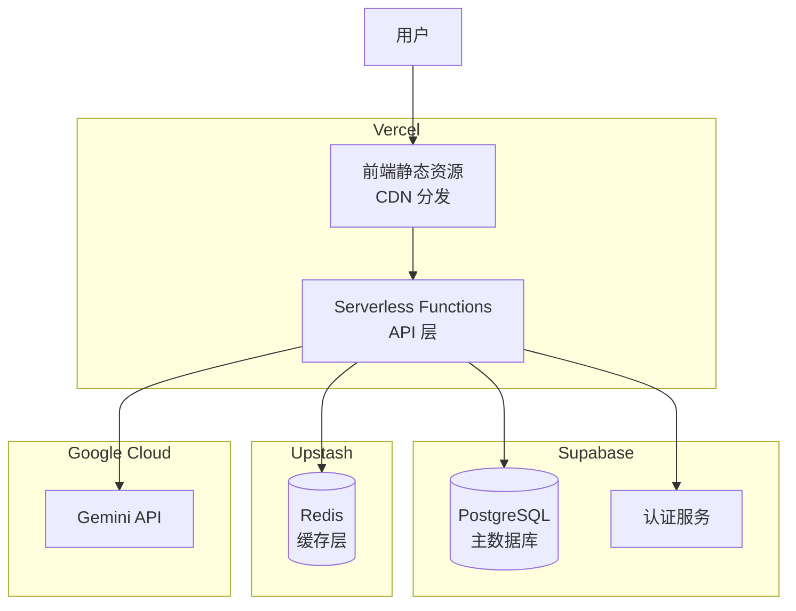

### 8.2 环境管理

#### 8.2.1 环境配置策略

| 环境 | 用途 | 数据库 | AI API | 域名 |
|------|------|--------|--------|------|
| 开发（local） | 本地开发 | Supabase 本地实例 | 测试 Key | localhost |
| 预发布（staging） | 测试验证 | 独立数据库 | 测试 Key | staging.mydea.app |
| 生产（production） | 正式服务 | 生产数据库 | 生产 Key | mydea.app |

#### 8.2.2 配置管理

**环境变量定义**：

| 变量名 | 开发环境 | 生产环境 | 说明 |
|--------|----------|----------|------|
| `SUPABASE_URL` | 本地地址 | 云端地址 | 数据库连接 |
| `SUPABASE_ANON_KEY` | 测试密钥 | 生产密钥 | 公开 API 密钥 |
| `GEMINI_API_KEY` | 测试密钥 | 生产密钥 | AI 服务密钥 |
| `REDIS_URL` | 可选 | 生产地址 | 缓存服务 |

### 8.3 发布流程设计

#### 8.3.1 CI/CD 流程

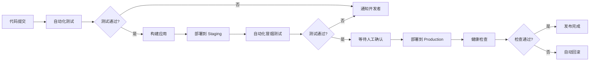

#### 8.3.2 灰度发布策略

| 阶段 | 流量比例 | 观察时间 | 回滚条件 |
|------|----------|----------|----------|
| Canary | 5% | 1 小时 | 错误率 > 2% |
| 小规模 | 25% | 4 小时 | 错误率 > 1% |
| 大规模 | 50% | 12 小时 | 错误率 > 0.5% |
| 全量 | 100% | - | - |

## 9. 实施路线图

### 9.1 第一阶段实施计划（2-3 周）

**目标**：解决核心安全问题，提升系统稳定性

| 任务 | 工作量 | 依赖 | 验收标准 |
|------|--------|------|----------|
| 搭建后端 API 服务 | 3 天 | 无 | 基础框架可运行 |
| 实现 AI 服务代理 | 2 天 | 后端框架 | 所有 Gemini 调用迁移完成 |
| 实现统一错误处理 | 2 天 | 无 | 错误码体系建立，友好提示 |
| 添加请求超时/重试 | 1 天 | AI 服务代理 | 超时自动重试，用户可感知 |
| 前端接入新 API | 2 天 | AI 服务代理 | 功能与原版本一致 |
| 测试与修复 | 2 天 | 所有功能 | 核心流程可用 |

**里程碑**：API Key 不再暴露，错误处理完善

### 9.2 第二阶段实施计划（3-4 周）

**目标**：实现数据持久化升级，建立测试体系

| 任务 | 工作量 | 依赖 | 验收标准 |
|------|--------|------|----------|
| Supabase 数据库设计 | 2 天 | 无 | 表结构创建，RLS 配置 |
| 数据迁移工具开发 | 3 天 | 数据库 | localStorage → Supabase |
| 数据服务层重构 | 3 天 | 数据库 | CRUD 操作正常 |
| 缓存层实现 | 2 天 | 数据服务 | Redis 集成，命中率监控 |
| 单元测试编写 | 5 天 | 核心功能 | 覆盖率 > 70% |
| 集成测试编写 | 3 天 | 单元测试 | 关键流程覆盖 |
| 数据迁移执行 | 1 天 | 迁移工具 | 现有用户数据无损迁移 |

**里程碑**：数据持久化可靠，测试覆盖充分

### 9.3 第三阶段实施计划（2-3 周）

**目标**：优化用户体验，提升性能

| 任务 | 工作量 | 依赖 | 验收标准 |
|------|--------|------|----------|
| 骨架屏实现 | 2 天 | 无 | 所有列表页支持 |
| 进度指示优化 | 2 天 | 无 | 分步骤显示生成过程 |
| 移动端适配 | 4 天 | 无 | 核心功能移动端可用 |
| 代码分割 | 2 天 | 无 | 初始包减少 40% |
| 组件性能优化 | 2 天 | 无 | 大列表渲染流畅 |
| E2E 测试编写 | 3 天 | 所有功能 | 关键旅程覆盖 |
| 监控接入 | 1 天 | 无 | 关键指标可观测 |

**里程碑**：用户体验显著提升，性能达标

### 9.4 风险与应对

| 风险 | 影响 | 概率 | 应对措施 |
|------|------|------|----------|
| Gemini API 不稳定 | 高 | 中 | 实现完善的重试和降级机制 |
| 数据迁移失败 | 高 | 低 | 充分测试，保留回滚方案 |
| 性能优化效果不达预期 | 中 | 中 | 逐步优化，监控指标验证 |
| 测试覆盖不足 | 中 | 中 | 优先覆盖核心流程 |
| 时间延期 | 低 | 中 | 按优先级调整，保证核心功能 |

## 10. 关键决策与权衡

### 10.1 架构决策

| 决策点 | 选择 | 权衡考虑 |
|--------|------|----------|
| 后端架构 | Serverless | 优：无运维成本，按需付费<br/>劣：冷启动延迟 |
| 数据库选型 | Supabase | 优：开发效率高，功能完善<br/>劣：供应商锁定风险 |
| 缓存方案 | Redis（可选） | 优：性能提升<br/>劣：增加复杂度和成本 |
| 测试框架 | Vitest | 优：与 Vite 集成良好<br/>劣：社区相对较小 |

### 10.2 实施优先级依据

**优先级评估矩阵**：

| 改进项 | 价值 | 紧急性 | 复杂度 | 综合优先级 |
|--------|------|--------|--------|------------|
| API 安全 | 高 | 高 | 中 | 🔴 极高 |
| 错误处理 | 高 | 高 | 低 | 🔴 极高 |
| 数据持久化 | 高 | 中 | 高 | 🔴 高 |
| 请求优化 | 中 | 中 | 中 | 🟡 中高 |
| 单元测试 | 中 | 中 | 中 | 🟡 中 |
| 性能优化 | 中 | 低 | 中 | 🟡 中 |
| 国际化 | 低 | 低 | 高 | 🟢 低 |

## 11. 附录

### 11.1 技术栈对比

**数据库方案对比**：

| 方案 | 优势 | 劣势 | 适用场景 |
|------|------|------|----------|
| Supabase | 开发快、功能全、免费额度 | 供应商锁定 | ✅ 当前项目 |
| Firebase | 生态成熟、文档丰富 | 成本高、Google 生态绑定 | 大型应用 |
| 自建 PostgreSQL | 完全控制、无锁定 | 运维成本高 | 企业级应用 |

**后端方案对比**：

| 方案 | 优势 | 劣势 | 适用场景 |
|------|------|------|----------|
| Serverless Functions | 零运维、按需付费 | 冷启动、执行时间限制 | ✅ 当前项目 |
| Node.js + Express | 灵活、成熟 | 需管理服务器 | 长连接需求 |
| Next.js API Routes | 一体化、易部署 | 与前端耦合 | 全栈应用 |

### 11.2 术语表

| 术语 | 说明 |
|------|------|
| RLS (Row Level Security) | 行级安全策略，Supabase 提供的数据访问控制机制 |
| Serverless | 无服务器架构，开发者无需管理服务器基础设施 |
| API 代理 | 中间层服务，转发客户端请求到真实 API |
| 灰度发布 | 逐步发布新版本给部分用户，降低风险 |
| 骨架屏 | 页面加载时显示的内容占位符 |
| 冷启动 | Serverless 函数首次调用或长时间未调用后的启动延迟 |

### 11.3 参考资源

| 资源类型 | 链接/说明 |
|----------|-----------|
| Supabase 文档 | https://supabase.com/docs |
| Vercel Serverless | https://vercel.com/docs/functions |
| Gemini API 文档 | https://ai.google.dev/docs |
| React 性能优化 | https://react.dev/learn/render-and-commit |
| Vitest 测试框架 | https://vitest.dev |

## 12. 开发实施指南

### 12.1 第一阶段实施详细步骤

本节提供第一阶段开发任务的详细实施指导，包括需要创建的文件、代码结构和集成方式。

#### 12.1.1 任务 1：创建错误处理系统

**目标**：建立统一的错误处理机制，提供友好的用户提示和完善的错误分类

**创建文件**：`utils/errors.ts`

**核心功能需求**：

| 功能模块 | 职责 | 导出内容 |
|----------|------|----------|
| AppError 类 | 自定义错误类型 | class AppError |
| ErrorCodes 常量 | 错误代码枚举 | const ErrorCodes |
| handleError 函数 | 错误转换处理 | function handleError() |
| validateBriefInput 函数 | 输入验证 | function validateBriefInput() |
| sanitizeInput 函数 | 输入清理 | function sanitizeInput() |

**AppError 类属性定义**：

| 属性 | 类型 | 说明 |
|------|------|------|
| message | string | 技术错误消息（用于日志） |
| code | string | 错误代码（来自 ErrorCodes） |
| userMessage | string | 用户友好的错误提示 |
| retryable | boolean | 是否可重试 |

**ErrorCodes 分类要求**：

```
客户端错误（CLI_）：
- CLI_INVALID_INPUT
- CLI_VALIDATION_ERROR

认证错误（AUTH_）：
- AUTH_TOKEN_EXPIRED
- AUTH_INVALID_TOKEN
- AUTH_UNAUTHORIZED

业务错误（BIZ_）：
- BIZ_QUOTA_EXCEEDED
- BIZ_BRIEF_TOO_LONG
- BIZ_INVALID_CREATIVE_TYPE

外部服务错误（EXT_）：
- EXT_GEMINI_TIMEOUT
- EXT_GEMINI_ERROR
- EXT_NETWORK_ERROR
- EXT_RATE_LIMIT

系统错误（SYS_）：
- SYS_DATABASE_ERROR
- SYS_UNKNOWN_ERROR
```

**handleError 函数逻辑**：

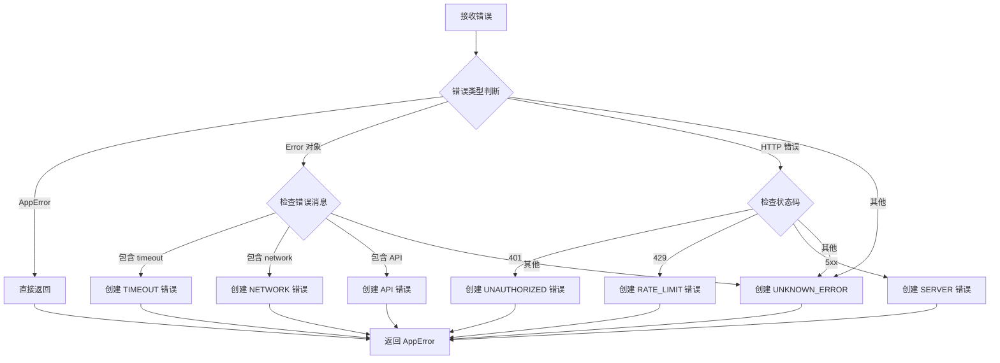

**输入验证规则**：

| 验证项 | 规则 | 错误类型 | 用户提示 |
|--------|------|----------|----------|
| 空内容 | text.trim().length === 0 | CLI_INVALID_INPUT | "需求描述不能为空" |
| 内容过长 | text.length > 5000 | BIZ_BRIEF_TOO_LONG | "需求描述过长，请控制在 5000 字以内" |

#### 12.1.2 任务 2：创建请求工具函数

**目标**：实现超时控制和自动重试机制

**创建文件**：`utils/request.ts`

**核心功能需求**：

| 函数名 | 功能 | 参数 | 返回值 |
|--------|------|------|--------|
| withTimeout | 为 Promise 添加超时控制 | fn, timeoutMs | Promise<T> |
| withRetry | 为函数添加重试逻辑 | fn, options | Promise<T> |
| sleep | 延迟函数 | ms | Promise<void> |

**withTimeout 函数设计**：

- 使用 Promise.race 实现超时
- 超时时抛出带有 timeout 关键字的错误
- 默认超时时间：30 秒

**withRetry 函数设计**：

**选项参数（RetryOptions）**：

| 选项 | 类型 | 默认值 | 说明 |
|------|------|--------|------|
| maxRetries | number | 3 | 最大重试次数 |
| initialDelay | number | 1000 | 初始延迟（毫秒） |
| maxDelay | number | 10000 | 最大延迟（毫秒） |
| backoffFactor | number | 2 | 退避系数 |
| retryableErrors | string[] | [] | 可重试的错误代码 |

**重试逻辑流程**：

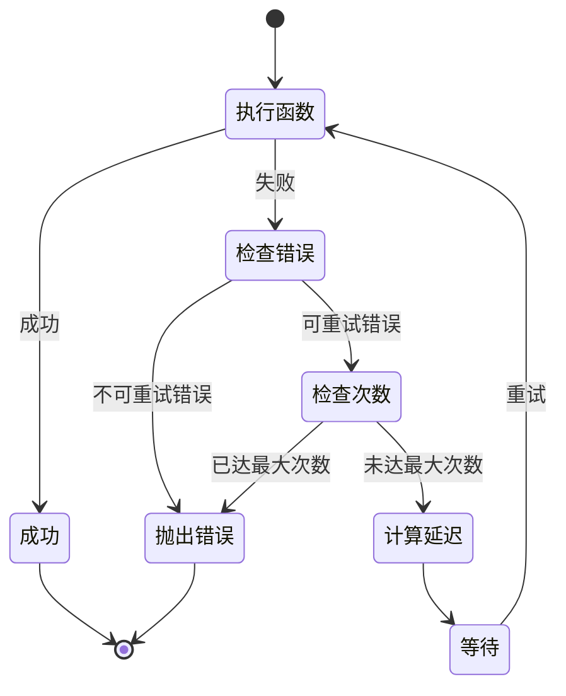

**退避策略计算**：

```
delay = min(
  initialDelay * (backoffFactor ^ retryCount),
  maxDelay
)

示例（指数退避）：
第1次重试：1000ms
第2次重试：2000ms
第3次重试：4000ms
```

#### 12.1.3 任务 3：重构 Gemini 服务层

**目标**：集成错误处理和请求优化，提升服务稳定性

**修改文件**：`services/geminiService.ts`

**改造要点**：

| 函数名 | 改造内容 | 优先级 |
|--------|----------|--------|
| refineBrief | 添加输入验证、超时控制、错误处理 | 高 |
| getInspirations | 添加超时控制、重试机制 | 高 |
| generateProposals | 添加超时控制、错误处理 | 高 |
| optimizeProposal | 添加超时控制、错误处理 | 中 |
| generateExecutionPlan | 添加超时控制、错误处理 | 中 |

**refineBrief 函数改造清单**：

1. **在函数开始处添加输入验证**：
   - 调用 `validateBriefInput(briefText)`
   - 调用 `sanitizeInput(briefText)`

2. **包装 API 调用**：
   - 使用 `withTimeout` 设置 15 秒超时
   - 使用 `withRetry` 配置重试（最多 2 次）

3. **统一错误处理**：
   - 使用 try-catch 捕获所有错误
   - 调用 `handleError()` 转换错误
   - 抛出 AppError

**getInspirations 函数改造清单**：

1. **添加超时控制**：20 秒
2. **添加重试机制**：最多 3 次，包含网络错误
3. **降级处理**：失败时返回友好的提示案例而非抛出错误

**超时时间配置表**：

| API 函数 | 超时时间 | 理由 |
|----------|----------|------|
| refineBrief | 15 秒 | Flash 模型，快速响应 |
| getInspirations | 20 秒 | 包含搜索，稍慢 |
| generateProposals | 45 秒 | Pro 模型，内容复杂 |
| optimizeProposal | 30 秒 | Pro 模型，单个优化 |
| generateExecutionPlan | 30 秒 | Pro 模型，文本生成 |

**重试配置表**：

| API 函数 | 最大重试次数 | 可重试错误 |
|----------|--------------|------------|
| refineBrief | 2 | 网络错误、超时 |
| getInspirations | 3 | 网络错误、超时、5xx |
| generateProposals | 2 | 网络错误、超时 |
| optimizeProposal | 2 | 网络错误、超时 |
| generateExecutionPlan | 2 | 网络错误、超时 |

#### 12.1.4 任务 4：创建错误展示组件

**目标**：在 UI 层统一展示错误信息

**创建文件**：`components/ErrorMessage.tsx`

**组件属性（Props）定义**：

| 属性 | 类型 | 必填 | 说明 |
|------|------|------|------|
| error | AppError \| null | 是 | 错误对象 |
| onRetry | () => void | 否 | 重试回调函数 |
| onDismiss | () => void | 否 | 关闭回调函数 |

**组件展示逻辑**：

| 条件 | 显示内容 |
|------|----------|
| error 为 null | 不渲染任何内容 |
| error.retryable === true | 显示重试按钮 |
| error.retryable === false | 仅显示关闭按钮 |

**视觉设计要求**：

| 错误类别 | 背景色 | 图标 | 样式类 |
|----------|--------|------|--------|
| 客户端错误 | 橙色 | ⚠️ | bg-orange-600 |
| 外部服务错误 | 黄色 | 🔄 | bg-yellow-600 |
| 系统错误 | 红色 | ❌ | bg-red-600 |

#### 12.1.5 任务 5：更新组件集成错误处理

**目标**：在现有组件中集成新的错误处理系统

**需要修改的组件**：

| 组件文件 | 修改内容 |
|----------|----------|
| CreativeBriefInput.tsx | 添加输入验证、错误展示 |
| BriefRefinement.tsx | 添加错误展示、重试逻辑 |
| GeneratingView.tsx | 添加错误处理、降级显示 |
| ResultsView.tsx | 添加错误展示 |

**通用修改模式**：

1. **添加状态管理**：
   ```
   const [error, setError] = useState<AppError | null>(null);
   ```

2. **包装异步调用**：
   ```
   try {
     setError(null);
     await someAsyncFunction();
   } catch (e) {
     const appError = handleError(e);
     setError(appError);
   }
   ```

3. **集成 ErrorMessage 组件**：
   ```
   在返回的 JSX 中添加：
   <ErrorMessage 
     error={error} 
     onRetry={handleRetry} 
     onDismiss={() => setError(null)} 
   />
   ```

### 12.2 第一阶段验收标准

#### 12.2.1 功能验收

| 验收项 | 验收方法 | 预期结果 |
|--------|----------|----------|
| 错误分类正确 | 触发各类错误，检查错误代码 | 错误代码符合分类规范 |
| 用户提示友好 | 触发错误，查看提示文案 | 文案清晰易懂，无技术术语 |
| 超时控制生效 | 模拟慢速 API，检查超时 | 超时后抛出 TIMEOUT 错误 |
| 重试机制正确 | 模拟临时失败，观察重试 | 按配置次数重试，延迟递增 |
| 可重试错误显示重试按钮 | 触发网络错误 | UI 显示重试按钮 |
| 不可重试错误不显示重试按钮 | 触发验证错误 | UI 仅显示关闭按钮 |

#### 12.2.2 代码质量验收

| 验收项 | 标准 |
|--------|------|
| TypeScript 类型完整 | 无 any 类型，所有导出函数有类型签名 |
| 错误处理完整 | 所有异步函数都有 try-catch |
| 代码注释清晰 | 关键函数有 JSDoc 注释 |
| 命名规范统一 | 遵循驼峰命名，常量全大写 |

#### 12.2.3 用户体验验收

| 场景 | 验收标准 |
|------|----------|
| 网络断开 | 3 秒内显示"网络连接失败"提示，提供重试按钮 |
| API 超时 | 显示"请求超时，请稍后重试"，自动重试 2 次 |
| 输入过长 | 立即显示"需求描述过长"，不发送请求 |
| 服务器错误 | 显示"系统暂时不可用"，提供重试选项 |

### 12.3 第一阶段技术债务记录

| 技术债务项 | 说明 | 计划解决阶段 |
|------------|------|---------------|
| API Key 仍在前端 | 当前仍直接调用 Gemini | 第二阶段（后端代理） |
| 无请求日志 | 错误日志仅在控制台 | 第三阶段（监控接入） |
| 缓存未实现 | 重复请求未缓存 | 第二阶段（缓存层） |

### 12.4 开发环境配置

#### 12.4.1 依赖安装

当前项目无需安装新依赖，所有工具函数使用 TypeScript 原生实现。

#### 12.4.2 开发调试建议

**调试错误处理**：

在浏览器控制台中测试：
```
测试方法（在 Console 中）：
1. 断网测试：开发者工具 -> Network -> Offline
2. 慢速网络：开发者工具 -> Network -> Slow 3G
3. 超时模拟：在 geminiService 中临时添加长延迟
```

**调试重试机制**：

在代码中临时添加日志：
```
在 withRetry 函数中添加：
console.log(`Retry attempt ${retryCount + 1}/${maxRetries}`);
```

### 12.5 常见问题与解决方案

#### 问题 1：错误未被正确分类

**症状**：所有错误都显示为 SYS_UNKNOWN_ERROR

**解决**：
1. 检查 handleError 函数的错误判断逻辑
2. 确保原始错误对象包含正确的信息
3. 在 catch 块中添加 console.log(error) 查看原始错误

#### 问题 2：重试次数过多

**症状**：请求失败后一直重试

**解决**：
1. 检查 withRetry 的 maxRetries 配置
2. 确认重试计数器正确递增
3. 检查退出条件是否正确

#### 问题 3：超时不生效

**症状**：请求长时间等待，未触发超时

**解决**：
1. 确认 withTimeout 正确包装了 Promise
2. 检查 Promise.race 是否正确实现
3. 验证超时时间配置是否生效

### 12.6 下一阶段准备工作

完成第一阶段后，为第二阶段（数据持久化）做准备：

**准备清单**：

- [ ] 注册 Supabase 账号
- [ ] 创建新的 Supabase 项目
- [ ] 获取 Supabase 连接信息（URL、anon key）
- [ ] 阅读 Supabase 文档（认证、数据库、RLS）
- [ ] 设计数据库表结构（参考本文档第 4 节）
- [ ] 准备数据迁移脚本（从 localStorage 导出数据）
