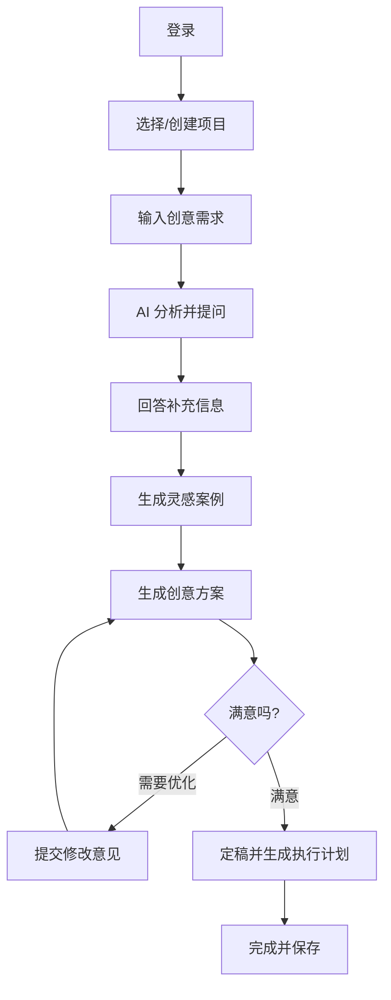

<div align="center">


# Mydea - AI 广告创意助手

**你的专属 AI 广告创意伙伴**

[](LICENSE)
[](https://reactjs.org/)
[](https://www.typescriptlang.org/)
[](https://vitejs.dev/)

[在线演示](https://ai.studio/apps/drive/1RyR4dxBnotzWHpt5iv7Nuw2qHecMW1hZ) | [用户指南](USER_GUIDE.md) | [开发文档](DEVELOPMENT.md) | [API 文档](API.md) | [部署指南](DEPLOYMENT.md)

</div>

---

## ✨ 功能特性

- 🎯 **智能需求分析** - AI 自动理解需求并提出针对性问题
- 🌍 **全球灵感搜索** - 实时获取最新的全球创意案例
- 💡 **多方案生成** - 一次生成 3 个不同风格的创意方案
- 🔄 **迭代优化** - 无限次优化，保留完整版本历史
- 📋 **项目管理** - 多项目组织，历史记录追溯
- 🚀 **执行计划** - 自动生成详细的落地方案

## 🎨 支持的创意类型

| 类型 | 描述 |
|------|------|
| 🏷️ **Slogan** | 品牌口号、标语创作 |
| 📱 **社交媒体文案** | 多平台内容创作 |
| 🎨 **平面设计** | 视觉创意方向 |
| 🎬 **视频创意** | 完整视频脚本 |
| 🎪 **公关活动** | 活动策划方案 |
| 🔤 **品牌命名** | 品牌/产品命名 |

## 🚀 快速开始

### 环境要求

- **Node.js** >= 18.0.0
- **npm** >= 9.0.0
- **Gemini API Key** ([获取方法](https://ai.google.dev/))

### 安装步骤

1. **克隆项目**
   ```bash
   git clone <repository-url>
   cd mydea
   ```

2. **安装依赖**
   ```bash
   npm install
   ```

3. **配置环境变量**
   
   在项目根目录创建 `.env.local` 文件：
   ```env
   GEMINI_API_KEY=your_gemini_api_key_here
   ```

4. **启动开发服务器**
   ```bash
   npm run dev
   ```
   
   访问 http://localhost:3000

### 构建生产版本

```bash
# 构建
npm run build

# 预览构建结果
npm run preview
```

## 📚 文档

- **[用户使用指南](USER_GUIDE.md)** - 详细的功能说明和使用技巧
- **[开发文档](DEVELOPMENT.md)** - 完整的开发指南和最佳实践
- **[API 文档](API.md)** - 服务层 API 详细说明
- **[部署指南](DEPLOYMENT.md)** - 生产环境部署流程

## 🏗️ 技术架构

### 核心技术栈

- **前端框架**: React 19.2.0 + TypeScript 5.8.2
- **构建工具**: Vite 6.2.0
- **AI 服务**: Google Gemini API
- **样式方案**: Tailwind CSS
- **数据存储**: localStorage (临时方案)

### 项目结构

```
mydea/
├── components/          # React 组件
│   ├── BriefRefinement.tsx
│   ├── CreativeBriefInput.tsx
│   ├── GeneratingView.tsx
│   ├── HomeScreen.tsx
│   ├── LoginScreen.tsx
│   ├── ProjectDashboard.tsx
│   ├── ProjectDetails.tsx
│   └── ResultsView.tsx
├── services/            # 业务逻辑
│   ├── geminiService.ts
│   └── databaseService.ts
├── App.tsx              # 应用入口
├── types.ts             # 类型定义
└── vite.config.ts       # Vite 配置
```

## 🎯 使用流程



## 🔧 开发

### 可用命令

```bash
# 开发
npm run dev          # 启动开发服务器

# 构建
npm run build        # 构建生产版本
npm run preview      # 预览构建结果

# 测试（需要配置）
npm test             # 运行测试
```

### 环境变量

| 变量名 | 说明 | 必需 |
|--------|------|------|
| `GEMINI_API_KEY` | Google Gemini API 密钥 | ✅ |

## 🚀 部署

### 推荐平台

- **[Vercel](https://vercel.com)** - 零配置部署
- **[Netlify](https://netlify.com)** - 自动 CI/CD
- **[Railway](https://railway.app)** - 支持后端服务

详细部署步骤请参考 [部署指南](DEPLOYMENT.md)

## 🤝 贡献

欢迎提交 Issue 和 Pull Request！

### 开发规范

1. 遵循 TypeScript 类型定义
2. 使用 ESLint 和 Prettier 格式化代码
3. 提交前确保构建成功
4. 编写清晰的 commit message

## 📝 许可证

MIT License

## 🙏 致谢

- [Google Gemini](https://ai.google.dev/) - 强大的 AI 能力
- [React](https://reactjs.org/) - 优秀的前端框架
- [Vite](https://vitejs.dev/) - 快速的构建工具
- [Tailwind CSS](https://tailwindcss.com/) - 灵活的样式方案

## 📞 联系方式

- 在线演示: https://ai.studio/apps/drive/1RyR4dxBnotzWHpt5iv7Nuw2qHecMW1hZ
- 问题反馈: 创建 GitHub Issue
- 技术支持: 查看 [常见问题](USER_GUIDE.md#常见问题)

---

<div align="center">
  Made with ❤️ by Mydea Team
</div>
